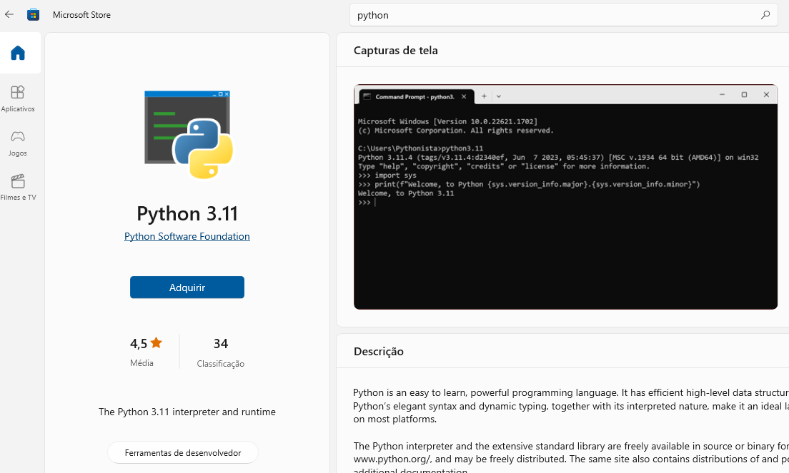
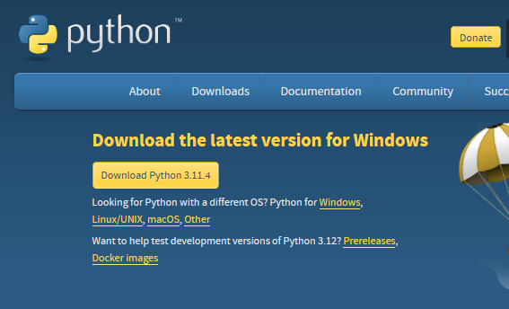

# VSCode/Github Codespace + Plugins

## VS Code

Visual Studio Code is a lightweight but powerful source code editor which runs on your desktop and is available for Windows, macOS and Linux. It comes with built-in support for JavaScript, TypeScript and Node.js and has a rich ecosystem of extensions for other languages and runtimes (such as C++, C#, Java, Python, PHP, Go, .NET)

IntelliSense.
Go beyond syntax highlighting and autocomplete with IntelliSense, which provides smart completions based on variable types, function definitions, and imported modules.

Git commands built-in.
Working with Git and other SCM providers has never been easier. Review diffs, stage files, and make commits right from the editor. Push and pull from any hosted SCM service.

Extensible and customizable.
Want even more features? Install extensions to add new languages, themes, debuggers, and to connect to additional services. Extensions run in separate processes, ensuring they won't slow down your editor

Deploy with confidence and ease
With Microsoft Azure you can deploy and host your React, Angular, Vue, Node, Python (and more!) sites

## Extensões

Python VS Code extension developed by Microsoft is a feature-rich Python extension that is completely free. VS Code will automatically suggest this extension when you start to create a .py file. Its IntelliSense feature enables useful functionality like code auto-completion, navigation, and syntax checking.

[Python Extension](https://lightrun.com/wp-content/uploads/2023/03/python_for_vscode.png)

Nome: Python Preview
Link do Marketplace do VS: https://marketplace.visualstudio.com/items?itemName=dongli.python-preview

Nome: Python
Link do Marketplace do VS: https://marketplace.visualstudio.com/items?itemName=ms-python.python

Nome: Jupyter
Link do Marketplace do VS: https://marketplace.visualstudio.com/items?itemName=ms-toolsai.jupyter

# Instalação do Interpretador Python

Para testar se a instalação ocorreu corretamente:

Apertar CTRL+R e digitar cmd ou powershell

- Digitar cmd ou powershell na barra de endereço de uma janela do windows explorer.
- Clicar com o botão direito numa região vazia do windows explorer, com o Shift apertado, e clicar "Abrir janela de comando/powershell aqui".
- Digite python que inicia o interpretador interativo

# Arquivos .md, .py e .ipynb

## Markdown (.md)

Um arquivo MD é um arquivo de texto criado usando um dos vários dialetos possíveis da linguagem Markdown. Ele é salvo em formato de texto simples, mas inclui símbolos de texto embutidos que definem como formatar o texto (por exemplo, negrito, recuos, cabeçalhos, formatação de tabela).

## Python Script (.py)

Um arquivo PY é um arquivo de programa ou script escrito em Python, uma linguagem de programação orientada a objetos interpretada. Ele pode ser criado e editado com um editor de texto, mas requer um interpretador Python para ser executado.

## Jupyter Notebook (.ipynb)

Um arquivo IPYNB é um documento de notebook usado pelo Jupyter Notebook, um ambiente computacional interativo projetado para ajudar os cientistas a trabalhar com a linguagem Python e seus dados. Ele contém todo o conteúdo da sessão do aplicativo da web Jupyter Notebook, que inclui as entradas e saídas de cálculos, matemática, imagens e texto explicativo.

# Interpretador no SO

# Execução no VSCode

# Execução github codespaces/apps

# Referencias

[VSCode](https://code.visualstudio.com/docs)
